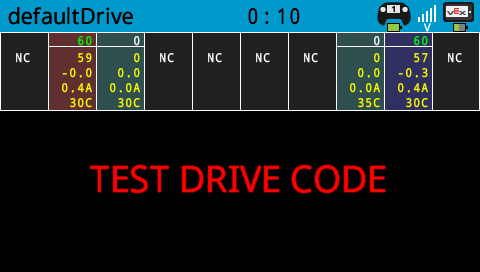
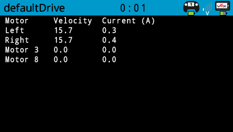

<ins>V5 drive code for a Clawbot</ins>
---

This code is a simplified version of the V5 brain internal drive code.

The major differences are  
1. Only a single controller is supported
2. Configuration for reversed motors has to be done in the code.
3. Configuration for drive control scheme has to be selected in the code.

The code is expected to be used on a standard V5 clawbot.  

Port configuration is as follows
```text
- Port  1 - Left Drive motor 1
- Port  2 - Right Drive motor 1 (reverse flag set)
- Port  3 - Motor 3 (Claw)
- Port  4 - Motor 4
- Port  5 - Motor 5
- Port  6 - Motor 6
- Port  7 - Motor 7
- Port  8 - Motor 8 (Arm)
- Port  9 - Left Drive motor 2
- Port 10 - Right Drive motor 2 (reverse flag set)

- 3 Wire A - Limit switch for motor 3 forward
- 3 Wire B - Limit switch for motor 3 reverse
- 3 Wire C - Limit switch for motor 8 forward
- 3 Wire D - Limit switch for motor 8 reverse
```

VEXcode V5 projects are provided using Blocks, C++ and Python.  The C++ and Python projects are provided with both graphical and text based motor and sensor configuration.  The block project only controls the four clawbot motors, the C++ and Python projects can control all ten motors in the same way as the internal V5 drive program.  
(note, the blocks project is using ports 2 and 9 for the display of left and right motor data, adjust as necessary)

VEXcode Pro V5 projects are provided with both text and graphical motor and sensor configuration.

C++ and Python projects show connected motors with some useful motor data.  The C++ and Python projects differ slightly due to API availabity.
data shown in order is  
- command speed (c++) or port number (python)
- motor velocity (rpm)
- motor position (revolutions)
- motor current (A)
- motor temperature (deg C)



The display for the blocks project is much simpler.




